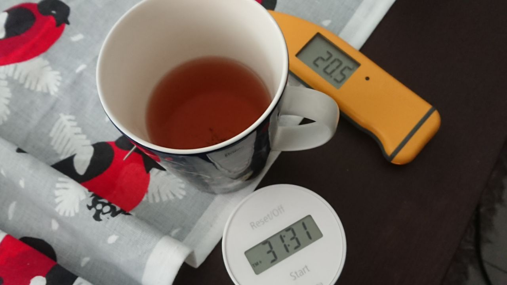
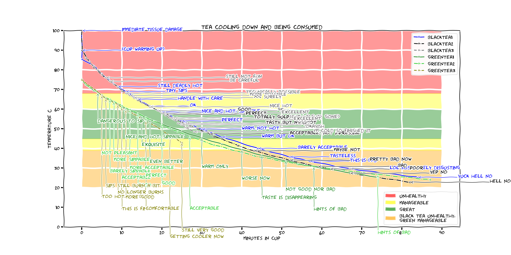
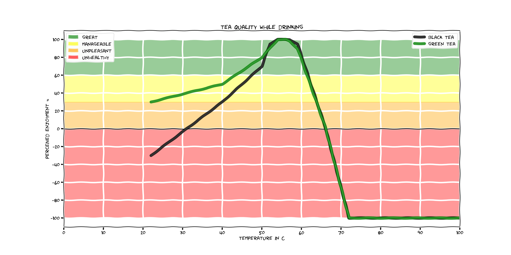

scientific tea experiment
=========================

With a typical quick and simple tea routine, when would be the brewed tea reach optimal settings for consumption?
The only way to find out is `to write it down`_.

.. _to write it down: https://www.tested.com/making/557288-origin-only-difference-between-screwing-around-and-science-writing-it-down/

Introduction
------------

Tea can be consumed for fun, enjoyment, routine, social bonding, caffeine, other reasons, or a combination of them.
With a specific ceremony of combining water with tea leaves for some time in a cup followed by drinking the resulting liquid, the perceived quality, or taste, varies until the teacup is empty.
Too cold tea can be unpleasant and too hot tea can even cause physical damage.
Somewhere in the middle the taste simply varies.
For optimal experience and just to get to know tea better and to just slack off in the middle of a workday, it would be useful to know if the variation in taste is consistent, repeatable, and more.

Methods
-------

A typical way to consume an amount of tea:

#. Pick favorite "cup" or actually a mug (~0.45 l)
#. Choose tea leaves, stuff inside a strainer
#. Pour boiling water over strainer (black tea) or pour water into mug and bring it to desired (~75 C) temperature (green tea) followed by inserting the strainer
#. Keep strainer in mug according to tea instructions (~3 minutes)
#. Track temperature and taste over time

   Test setting involved a mug, a thermometer and a timer

Results
-------

Test environment
~~~~~~~~~~~~~~~~

* Black tea starts with boiling water that cools down rapidly when poured into room-temperature mug
* Green tea starts with calibrated 75 C water inside mug
* Brewing time three minutes after which strainer is removed from mug
* Ambient temperature: chill room temperature, 20-ish C
* Temperature measurement point: probe swirled around a couple of seconds, then middle of the mug
* Taste measurement method: `the whisky way`_ unless too hot

.. _the whisky way: https://www.youtube.com/watch?v=BW1te_miu5I#t=1m31s

Data
~~~~

The black and green teas were arbitrarily chosen from a collection of a few and none of these are pure tea but have something extra in there (e.g., citrus notes).

   Black and green tea were done three times each.

   On some data points, right after sampling the temperature the tea was tasted and overall feel was recorded, depicted by labels.
   The labels apply to temperatures at and below the mark until there's a new label.

Surface temperature drops rapidly even after mixing, easily 0.5-1 C lower than deeper.

   Tea quality spikes in 56-ish C for both black and green tea, then drops steadily but green tea stays more enjoyable longer.

   The y axis may depend on observer, mood, time of year and any other variables.
   Error bars were omitted due to insufficient data. Peak values are fairly accurate; relative numbers are rough (e.g., might even be logarithmic instead of linear).

Conclusions, future work
------------------------

Tea quality in these specific circumstances is very consistent.
Now just integrate that quality graph and see when to start and when to stop drinking for optimized overall happiness.
Or at least set a timer at 14 or 21 min depending on tea to not forget the mug there.

* At least it's quite clear that any tea is optimal at around 56 C
* Green tea takes ~14 min to reach that in these circumstances; black tea takes ~21 min
* The three minutes of brewing happens in much less heat on average than the specified "boiling" or "75 C" as the mug cools down quickly, maybe it should be insulated from the top initially with a coaster?

This leaves us with some additional questions.

* What if the temperature is kept at exactly the temperature spec'd for the tea (100 or 75 C) during the entire brew?
* Do commercial tea maker machines take this brewing time into account or do they just heat up to some temperature followed by turning off?
* Will the tea be equally good if kept at the optimal temperature over a longer period of time? Will something tasty evaporate? Will the epsilon amount of tea leaf dust that escaped the strainer to the bottom of the mug make it worse?
* Does the tea leaf dust make it worse in the end of the measurement period or is it just the temperature?
* What about cold brew tea? It's good at fridge temperature; does it become worse in room temperature as well?
* What about herbal tea?
* What about other mugs?
